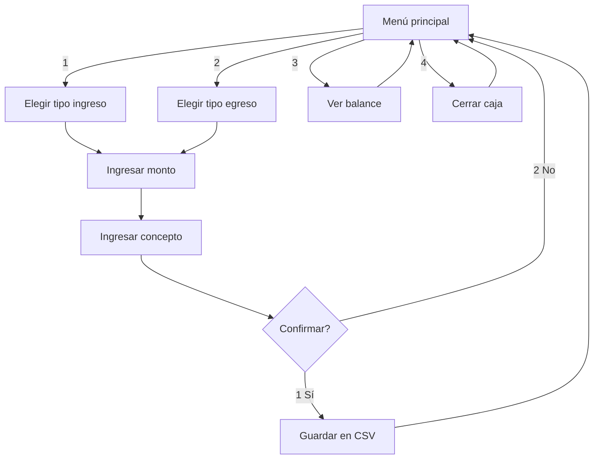

# Manual de usuario — Paquito (Bot de Caja)

Guía rápida para usar el bot de Telegram **Paquito** en el día a día de la vidriería.

---

## Cómo empezar

1. Abrí Telegram y buscá el bot por el nombre que le diste al crearlo con BotFather.
2. Enviá cualquier mensaje de texto para iniciar la conversación.
3. El bot responde con el **menú principal** y queda a la espera de que elijas una opción (número del 1 al 4).

> **Importante:** el bot solo entiende **texto plano**. Escribí el número de la opción (por ejemplo `1`), no hace falta usar barras ni comandos especiales.

---

## Menú principal

Al iniciar o volver al menú verás:

```
Bienvenido al sistema de caja 🏪
Vidrieria familiar

Que deseas hacer?
1 - Registrar ingreso
2 - Registrar egreso
3 - Ver balance del dia
4 - Cerrar caja del dia

Paquito a tu disposicion!
```

| Opción | Acción |
|--------|--------|
| **1** | Inicia el registro de un **ingreso** (entrada de dinero). |
| **2** | Inicia el registro de un **egreso** (salida de dinero). |
| **3** | Muestra ingresos, egresos y balance **solo del día actual**. Si el balance es negativo, envía una alerta. |
| **4** | Muestra el balance del día y cierra la caja (mensaje de despedida). El estado de la conversación se reinicia. |

Si escribís otra cosa, el bot avisa que la opción no es válida y vuelve a mostrar el menú.

---

## Registrar un ingreso (opción 1)

### Paso 1 — Tipo de ingreso

```
Tipo de ingreso:
1 - Venta en mostrador
2 - Seña de pedido
3 - Otro
```

Respondé con `1`, `2` o `3`.

### Paso 2 — Monto

```
Ingresa el monto:
```

Escribí un número positivo. Ejemplos válidos: `1500`, `2350.50`.

Si el monto no es válido, el bot te pide que lo ingreses de nuevo **sin cancelar** el registro.

### Paso 3 — Concepto

```
Describe brevemente el movimiento:
```

Escribí una descripción corta, por ejemplo: `Venta espejo redondo 50cm`.

No puede quedar vacío.

### Paso 4 — Confirmación

El bot muestra un resumen:

```
Confirmas el registro?

Tipo: ingreso
Categoria: venta
Monto: $1500.0
Concepto: Venta espejo redondo 50cm

1 - Si, guardar
2 - No, cancelar
```

| Respuesta | Resultado |
|-----------|-----------|
| **1** | Guarda el movimiento en `movimientos.csv` y vuelve al menú principal. |
| **2** | Descarta el registro y vuelve al menú principal. |

---

## Registrar un egreso (opción 2)

El flujo es el mismo que el ingreso, pero primero elegís el **tipo de egreso**:

```
Tipo de egreso:
1 - Compra de materiales
2 - Gasto fijo
3 - Retiro personal
```

Luego: monto → concepto → confirmación.

---

## Ver balance del día (opción 3)

Muestra un resumen como:

```
Balance del dia:

Total ingresos: $25000.0
Total egresos: $8200.0
Balance: $16800.0 (POSITIVO)
```

- Solo cuenta movimientos registrados **hoy** (fecha del servidor donde corre el bot).
- Si el balance es **negativo**, recibirás un mensaje de alerta adicional.
- Después de consultar, el menú principal se muestra de nuevo (no cerrás la caja).

---

## Cerrar caja del día (opción 4)

1. Muestra el mismo resumen de balance del día.
2. Envía el mensaje: *"Caja cerrada. Hasta manana!"*
3. Reinicia tu conversación al menú principal.

> **Nota:** cerrar caja no borra ni archiva los movimientos en el CSV; solo es un cierre simbólico en la conversación. Los datos del día siguen en `movimientos.csv`.

---

## Errores frecuentes y qué hacer

| Situación | Qué pasa | Qué hacer |
|-----------|----------|-----------|
| Monto con letras o cero | Mensaje de monto inválido | Reingresar un número positivo |
| Opción fuera del menú | *"Opcion no reconocida"* | Elegir 1, 2, 3 o 4 según corresponda |
| Concepto vacío | Pide describir de nuevo | Escribir al menos una palabra |
| Quiero cancelar a mitad de un registro | No hay tecla "atrás" | Completar hasta confirmación y elegir **2 - No, cancelar**, o reiniciar el bot (el estado en memoria se pierde al reiniciar el servidor) |

---

## Resumen de flujo



---

## Funcionalidades no disponibles aún

El código incluye soporte para **pedidos** (`pedidos.csv`), pero el menú de Telegram **todavía no** permite crear ni consultar pedidos. Esa parte está prevista para una versión futura.
