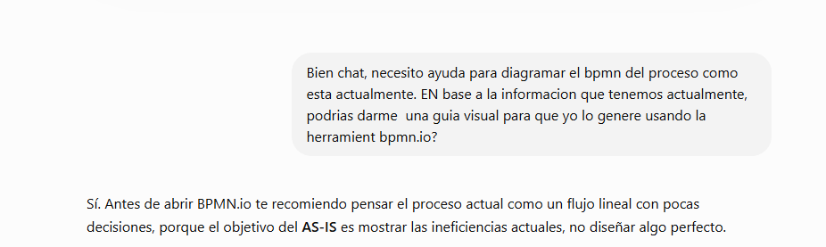
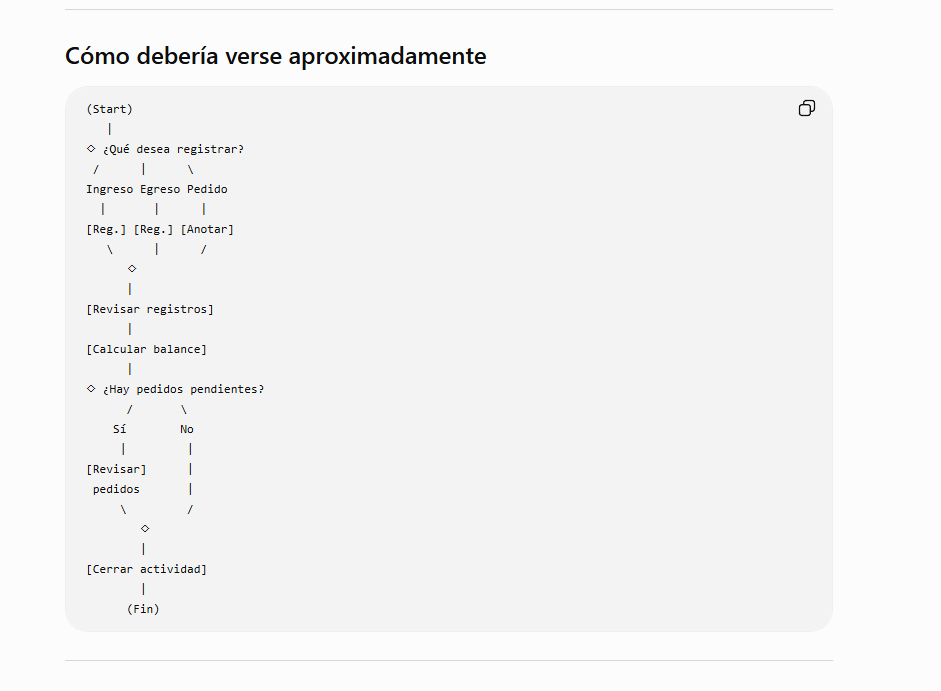
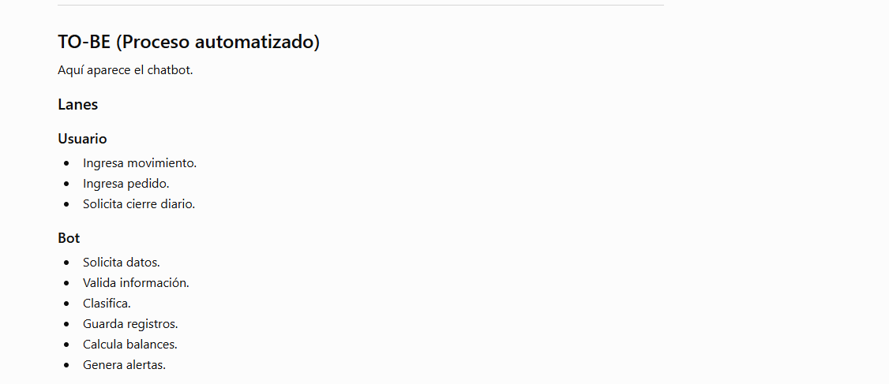
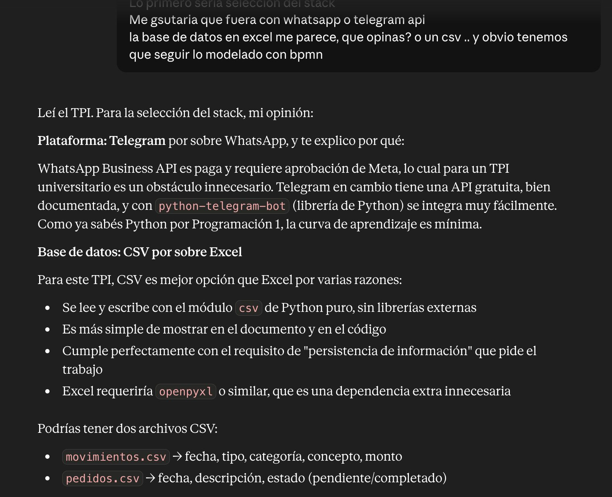
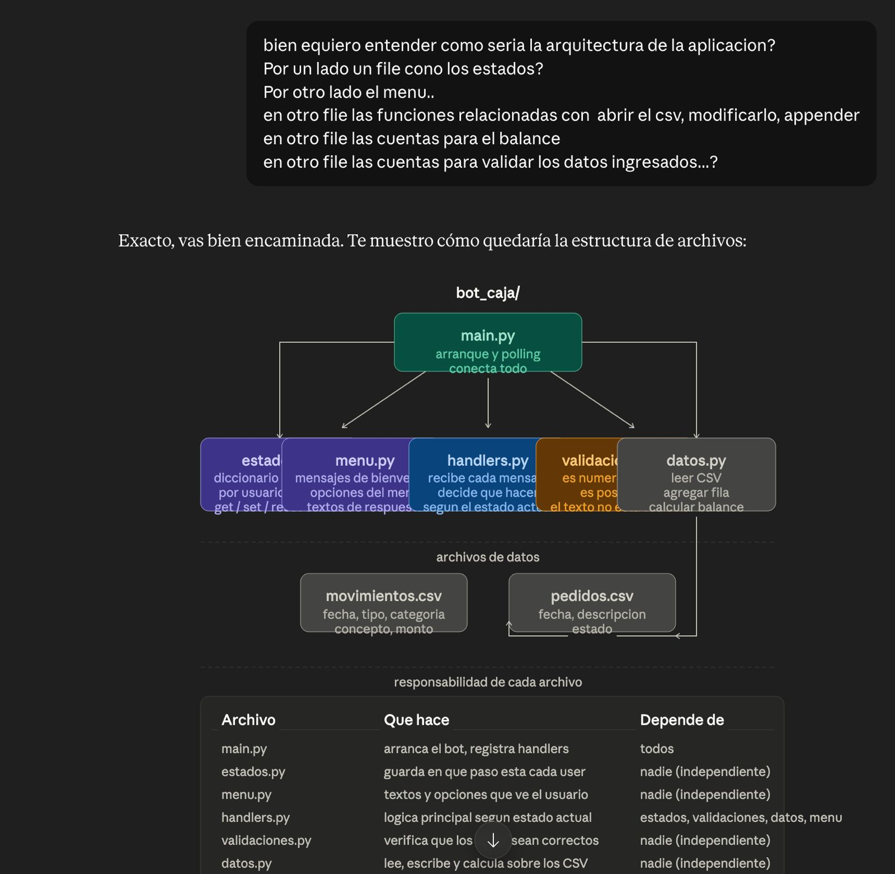
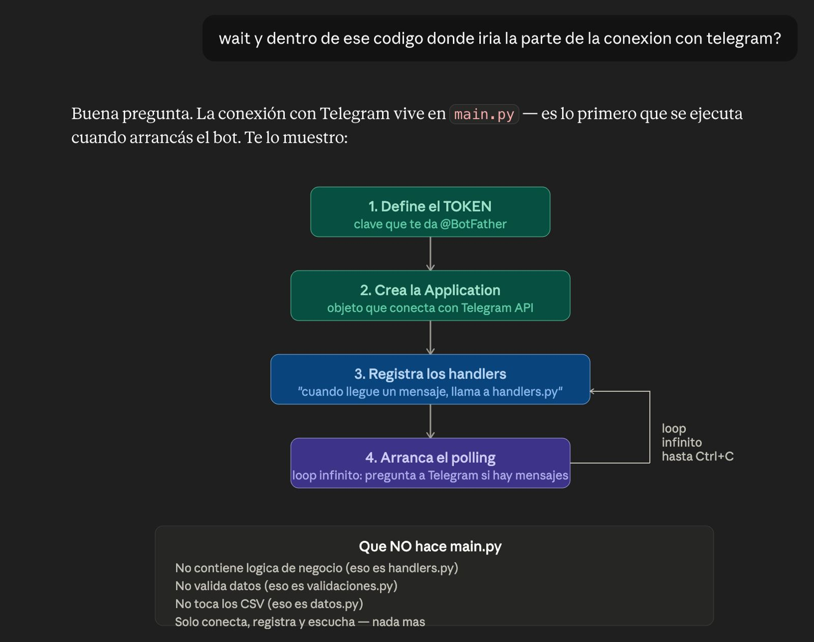
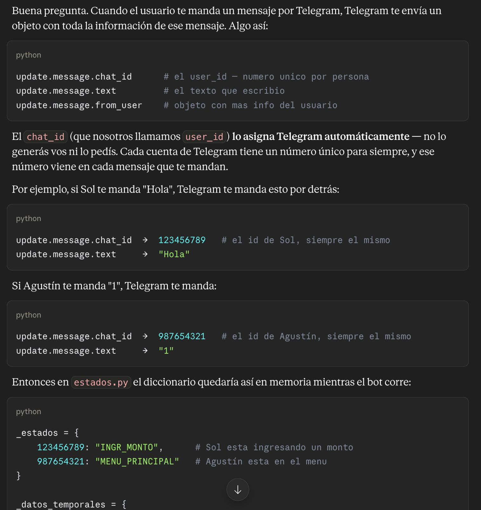
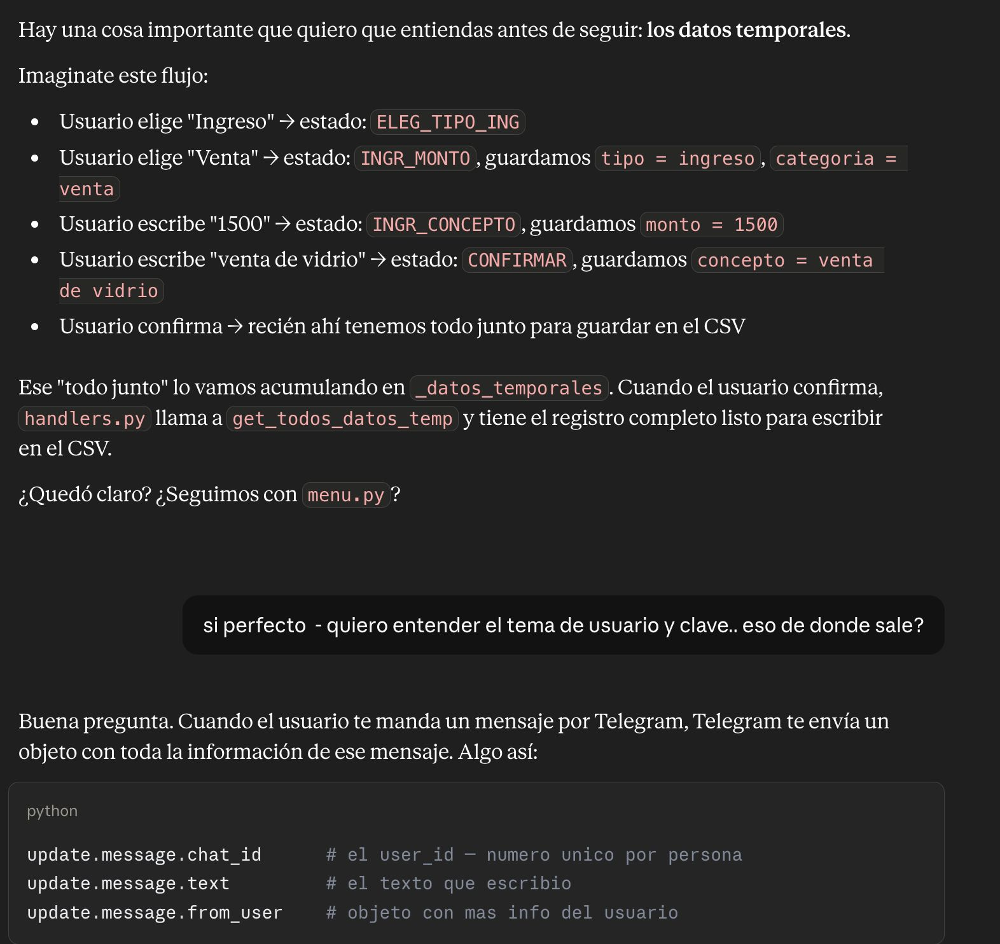
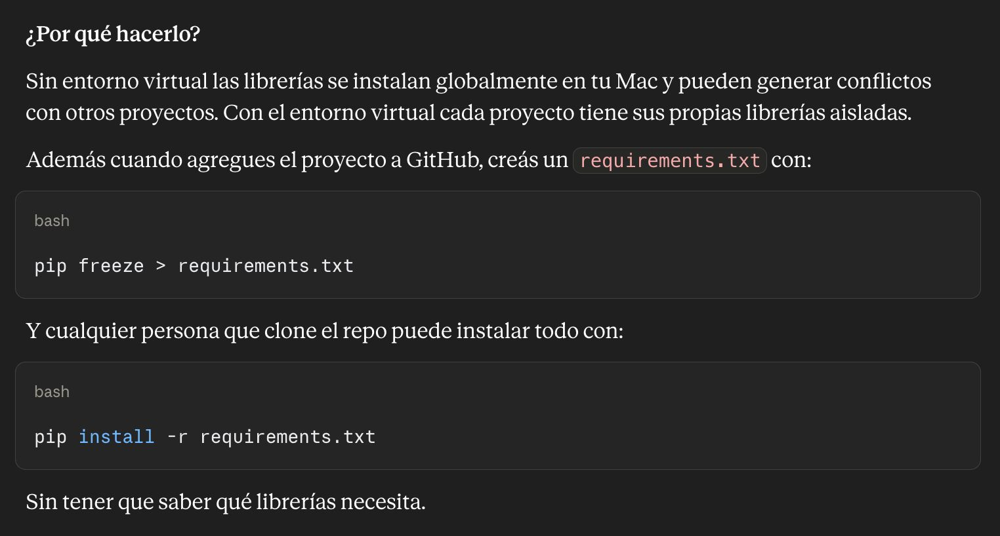

# Proceso de desarrollo

Registro del trabajo realizado con asistencia de IA para el Trabajo Práctico Integrador de **Organización Empresarial** (TUP UTN).

Este documento complementa el código fuente y documenta las decisiones tomadas durante el diseño del bot **Paquito**, con capturas de las conversaciones de referencia en [`assets/conversaciones-ia/`](assets/conversaciones-ia/).

---

## Contexto del proyecto

**Paquito** es un bot de Telegram para una vidriería familiar. Reemplaza anotaciones informales de caja por registros estructurados de ingresos y egresos, con consulta de balance diario.

Objetivos de negocio:

- Registrar entradas y salidas de efectivo con categoría y concepto.
- Conocer el balance del día en cualquier momento.
- Recibir alerta si la caja del día queda en negativo.
- Simular cierre de caja al final de la jornada.

---

## 1. Modelado del proceso (AS-IS y TO-BE)

El TPI exige modelar el proceso con BPMN. La primera etapa fue diagramar cómo funciona la caja **hoy** (AS-IS) y cómo debería funcionar **con el bot** (TO-BE).

### Guía para el diagrama AS-IS

Se pidió a la IA una guía visual para armar el BPMN en [bpmn.io](https://bpmn.io), pensando el proceso actual como un flujo lineal con pocas decisiones — el objetivo del AS-IS es mostrar ineficiencias, no diseñar algo perfecto.



### Proceso actual (AS-IS)

Flujo manual aproximado de la vidriería:

```
(Inicio)
  → ¿Qué desea registrar?
      ├─ Ingreso  → [Reg.]
      ├─ Egreso   → [Reg.]
      └─ Pedido   → [Anotar]
  → [Revisar registros]
  → [Calcular balance]
  → ¿Hay pedidos pendientes?
      ├─ Sí → [Revisar pedidos]
      └─ No → (continúa)
  → [Cerrar actividad]
(Fin)
```



**Ineficiencias identificadas:** registros dispersos (papel, WhatsApp, memoria), cálculo manual del balance, pedidos difíciles de rastrear y riesgo de error al cerrar la jornada.

### Proceso objetivo (TO-BE)

Con el bot, el flujo se reparte entre **Usuario** y **Bot**:

| Lane Usuario | Lane Bot |
|--------------|----------|
| Ingresa movimiento | Solicita datos |
| Ingresa pedido | Valida información |
| Solicita cierre diario | Clasifica |
| | Guarda registros |
| | Calcula balances |
| | Genera alertas |



> **Alcance actual del código:** ingresos, egresos, balance y cierre están implementados. La gestión de pedidos quedó preparada en `pedidos.csv` pero aún no tiene menú en Telegram.

---

## 2. Decisiones técnicas del TPI

Antes de escribir código, se definieron las tecnologías en función de las restricciones del trabajo práctico.



| Decisión | Elección | Motivo |
|----------|----------|--------|
| Canal de mensajería | **Telegram** (no WhatsApp) | API gratuita y documentada; WhatsApp Business requiere aprobación de Meta y es pago |
| Librería Python | **python-telegram-bot** | Curva de aprendizaje acotada con Python de Programación 1 |
| Persistencia | **CSV** (no Excel) | Módulo `csv` nativo, sin dependencias extra; cumple el requisito de persistencia |
| Modelado | **BPMN** | Obligatorio para la materia Organización Empresarial |

**Entidades de datos acordadas:**

- `movimientos.csv` → `fecha`, `tipo`, `categoria`, `concepto`, `monto`
- `pedidos.csv` → `fecha`, `descripcion`, `estado` (pendiente / completado)

Detalle completo en [diccionario-datos.md](diccionario-datos.md).

---

## 3. Arquitectura modular del código

Se diseñó una estructura donde cada archivo tiene una responsabilidad clara. La IA validó la propuesta del equipo y la tradujo al árbol de módulos que hoy existe en el repositorio.



| Archivo | Responsabilidad | Depende de |
|---------|-----------------|------------|
| `main.py` | Arranque, polling, registro de handlers | todos |
| `estados.py` | Estado actual de cada usuario (`get`, `set`, `reset`) | — |
| `menu.py` | Textos, menús y mensajes al usuario | — |
| `handlers.py` | Lógica según el estado del usuario | `estados`, `validaciones`, `datos`, `menu` |
| `validaciones.py` | Monto numérico positivo, opciones válidas, texto no vacío | — |
| `datos.py` | Leer/escribir CSV y calcular balance | — |

---

## 4. Punto de entrada: conexión con Telegram

`main.py` concentra únicamente la conexión con la API de Telegram. No contiene lógica de negocio.



```
1. Cargar TOKEN desde .env
2. Crear Application (conexión con Telegram API)
3. Registrar handlers → "cuando llegue un mensaje, llama a handlers.py"
4. Arrancar polling (loop hasta Ctrl+C)
```

**Qué NO hace `main.py`:** validar datos (`validaciones.py`), manejar estados (`estados.py`) ni tocar CSV (`datos.py`).

---

## 5. Identificación de usuarios y máquina de estados

Telegram identifica a cada persona con un `chat_id` único. El bot lo usa como `user_id` para saber en qué paso del flujo está cada uno.



Ejemplo en memoria mientras el bot corre:

```python
_estados = {
    123456789: "INGR_MONTO",      # Sol ingresando un monto
    987654321: "MENU_PRINCIPAL",  # Agustín en el menú principal
}
```

No hace falta login ni contraseña: Telegram entrega `update.message.chat_id`, `update.message.text` y `update.message.from_user` en cada mensaje.

---

## 6. Flujo de registro y datos temporales

Mientras el usuario completa un ingreso o egreso, los datos se acumulan en `_datos_temporales` hasta la confirmación. Solo entonces se escribe una fila en `movimientos.csv`.



| Paso | Acción del usuario | Estado | Dato guardado |
|------|--------------------|--------|---------------|
| 1 | Elige ingreso | `ELEG_TIPO_ING` | — |
| 2 | Elige venta | `INGR_MONTO` | `tipo=ingreso`, `categoria=venta` |
| 3 | Escribe `1500` | `INGR_CONCEPTO` | `monto=1500` |
| 4 | Escribe concepto | `CONFIRMAR` | `concepto=...` |
| 5 | Confirma (`1`) | `MENU_PRINCIPAL` | fila en CSV |

`handlers.py` usa `get_todos_datos_temp()` para armar el registro completo antes de llamar a `guardar_movimiento()`.

---

## 7. Entorno de desarrollo

Para evitar conflictos entre proyectos, cada desarrollador usa un entorno virtual aislado y comparte dependencias vía `requirements.txt`.



```bash
# Generar el archivo de dependencias
pip freeze > requirements.txt

# Instalar al clonar el repo
pip install -r requirements.txt
```

Instrucciones completas de setup en el [README](../README.md).

---

## Índice de capturas

| Archivo | Tema |
|---------|------|
| `bpmn-as-is-guia.png` | Guía para diagramar AS-IS en bpmn.io |
| `proceso-as-is.png` | Flujo manual actual de la caja |
| `proceso-to-be.png` | Proceso automatizado (lanes Usuario / Bot) |
| `decisiones-tecnicas.jpeg` | Telegram vs WhatsApp, CSV vs Excel |
| `arquitectura-modular.jpeg` | Estructura de archivos y dependencias |
| `main-conexion-telegram.jpeg` | Rol de `main.py` y polling |
| `identificacion-usuario.jpeg` | `chat_id` y diccionario `_estados` |
| `flujo-datos-temporales.jpeg` | Registro multi-paso y confirmación |
| `entorno-virtual-requirements.jpeg` | venv y `requirements.txt` |

---

## Referencias

- [Diccionario de datos](diccionario-datos.md)
- [Manual de usuario](manual-usuario.md)
- [README del repositorio](../README.md)
